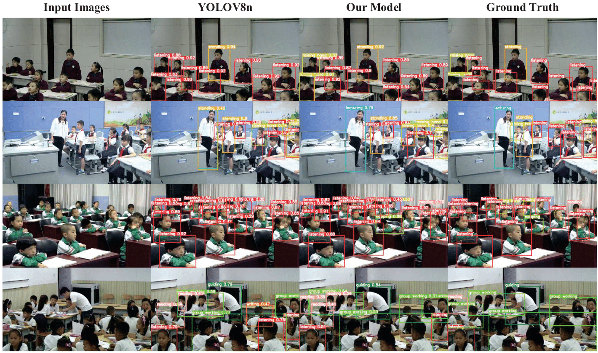

# Introduction
This repository contains the official implementation of our paper:
Optimizing Lightweight Networks for Small Object Detection in Classroom Behavior Recognition-The Visual Computer, 2025

# Requirements
    pip install -r requirements.txt
# Train
    We give an example, more details please see train.py
    Python train.py
# Test
    We give an example, more details please see val.py
    Python val.py
# Dataset
The STCB Dataset is available at:
[Click here to download from Baidu Drive ( Extraction Code: efbw)]( https://pan.baidu.com/s/14Nxn1o4TZRI1QVm4m5v9Wg?pwd=efbw).
We give an example of images in STCB Dataset.

